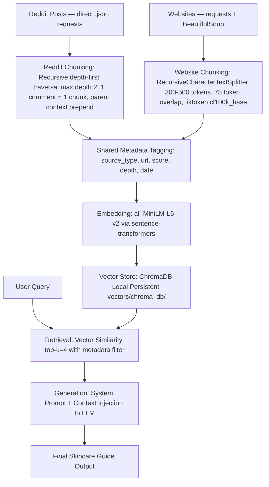

# Project 1 Planning: The Unofficial Guide
---

## Domain

This system serves as an unofficial guide for skincare beginners living in hot, humid tropical climates who are on a budget. Standard skincare advice often recommends heavy, expensive products that clog pores or melt off in extreme humidity and sweat. By aggregating community-vetted threads and ingredient guides focused on lightweight, affordable formulations (like gels and fluid sunscreens), this tool helps users build an effective, sweat-proof routine without overspending.

---

## Documents

| # | Source | Description | URL or location |
|---|--------|-------------|-----------------|
| 1 | 1883 Magazine | The Beauty Editor's Guide to What to Buy When Travelling to Asia | https://1883magazine.com/the-beauty-editors-guide-to-what-to-buy-when-travelling-to-asia/ |
| 2 | V10 Plus Blog | Skin Care Secrets for Thriving in Southeast Asia's Tropical Climate | https://v10plus.com/blogs/news/skin-care-secrets-for-thriving-in-southeast-asias-tropical-climate |
| 3 | Dewsia Article | Ultimate Skincare Routine for Hot and Humid Tropical Weather | https://dewsia.com/skincare-routine-tropical-weather/ |
| 4 | r/AsianBeauty | Best & HG Products for Tropical/humid climates | https://www.reddit.com/r/AsianBeauty/comments/1cffssa/best_hg_products_for_tropicalhumid_climates/ |
| 5 | r/SkincareAddiction | Routine Help: How humid weather completely changed my routine | https://www.reddit.com/r/SkincareAddiction/comments/1otyffj/routine_help_how_humid_weather_completely_changed/ |
| 6 | r/AsianBeauty | Oily/combo acne prone, sensitive, humid climate routines | https://www.reddit.com/r/AsianBeauty/comments/1ryi2ea/oily_combo_acne_prone_sensitive_humid_climate/ |
| 7 | r/AsianBeauty | Day and night moisturiser choices for tropical climates | https://www.reddit.com/r/AsianBeauty/comments/xuezv1/for_those_living_in_tropical_climates_what_day/ |
| 8 | r/AsianBeauty | Massive community list of budget HG products | https://www.reddit.com/r/AsianBeauty/comments/14jrgkc/what_are_your_budget_hg_products/ |
| 9 | IncideCoder Wiki | Niacinamide: Sebum regulation & barrier repair mechanics | https://incidecoder.com/ingredients/niacinamide |
| 10 | IncideCoder Wiki | Salicylic Acid / BHA: Lipophilic pore clearing properties | https://incidecoder.com/ingredients/salicylic-acid |
| 11 | IncideCoder Wiki | Dimethicone: Lightweight silicone barriers vs heavy occlusives | https://incidecoder.com/ingredients/dimethicone |

---

## Chunking Strategy

**Chunk size:**
- Reddit (via `.json` scraping): 1 comment = 1 chunk (no fixed token split)
- Website (scraped articles/pages): 300–500 tokens per chunk

**Overlap:**
- Reddit: Parent comment first 150 characters prepended to reply chunks
- Website: 75 token overlap between chunks

**Reasoning:**
Two sources are used — Reddit and skincare websites — each with
different document structures, so chunking is handled per source.

**Reddit (direct `.json` + recursive traversal):**
Reddit's self-service API (PRAW) was closed to new developers in 2025.
Instead, Reddit data is fetched by appending `.json` to any post URL
and calling it via `requests` with a descriptive User-Agent header.
This returns the same structured comment tree that PRAW used internally —
each comment arrives as a clean JSON object with score, depth, and
created_utc already attached. No credentials or API key are required.

Each comment is treated as one atomic chunk. Recursive depth-first
traversal walks the tree up to depth 2. Top-level comments (depth 0)
are chunked standalone. Replies (depth 1) prepend the first 150
characters of their parent comment so the chunk remains meaningful
in isolation. Traversal stops at depth 2 to avoid off-topic banter.
No token splitting is needed since Reddit comments naturally average
80–200 tokens.

**Website (requests + BeautifulSoup):**
Website content is long-form HTML — articles, ingredient guides,
product descriptions — with no natural atomic boundary. `requests`
fetches the raw HTML and BeautifulSoup strips noise tags (nav, footer,
script, style) before extracting clean body text. That text is then
split using RecursiveCharacterTextSplitter at 300–500 tokens with
75 token overlap. Chunking is token-based (tiktoken cl100k_base) to
stay predictable for the embedding model.

**Why `.json` for Reddit instead of BeautifulSoup:**
BeautifulSoup parses raw HTML — it would require fragile CSS selectors
to extract comment text, scores, and thread depth from Reddit's page
structure, which changes frequently. Reddit's `.json` endpoint returns
pre-structured data with all metadata already attached, making it
faster, more reliable, and simpler to maintain. BeautifulSoup is
reserved for external websites where no structured API exists.

**Shared metadata tagged on every chunk:**
- `source_type`: `"reddit"` | `"website"`
- `url`
- `score` (Reddit only)
- `date` (Reddit only)
- `depth` (Reddit only)

This lets the retriever filter or weight by source at query time —
useful if you want to prioritize community experience (Reddit) over
curated content (website) or vice versa.

---

## Retrieval Approach

**Embedding model:** `all-MiniLM-L6-v2` (via sentence-transformers)

**Vector store:** ChromaDB (local persistent storage)

**Top-k:** 4 chunks

**Production tradeoff reflection:**
If migrating to production for real users without budget constraints,
I would evaluate a frontier embedding model like OpenAI's
`text-embedding-3-large` or Cohere's `embed-english-v3.0`. The
`all-MiniLM-L6-v2` model caps out at a 256-token context window,
forcing a tighter chunking scheme. A larger production model allows
for longer context windows, superior handling of domain-specific
chemical terminology (e.g., distinguishing between ethylhexyl
methoxycinnamate and zinc oxide), and drastically better
multilingual/slang alignment — crucial given that regional beauty
subreddits heavily employ localized slang, brand short-hands, and
mixed languages.

---

## Evaluation Plan

| # | Question | Expected answer |
|---|----------|-----------------|
| 1 | I live in a very humid climate and my face is a grease slick by noon. What budget morning routine will keep me matte without drying out? | Use a gentle water-based/gel cleanser, a lightweight sebum-regulating serum (like Niacinamide), and skip heavy creams entirely. Finish with a sebum-controlling chemical or milk-type fluid sunscreen that dries matte. |
| 2 | Are heavy cream moisturizers bad for tropical weather? What affordable alternatives should a beginner look for? | Yes, heavy occlusive creams can trap sweat and sebum in high humidity, causing breakouts and a greasy texture. Beginners should look for affordable oil-free water-gels, gel-creams, or aloe/soothing gels (e.g., Holika Holika, Illiyoon, or Isntree). |
| 3 | I sweat a lot walking around. What is a highly-rated, cheap sunscreen that won't melt off or leave a white cast? | Look for lightweight, fluid/milk-type sunscreens with matte or sebum-control finishes (like Bioré UV Aqua Rich Watery Essence or Skin Aqua UV Super Moisture Gel). They are cheap, absorb cleanly, and do not leave heavy white masks. |
| 4 | My skin feels tight but looks oily (dehydrated oily). How do I fix this using cheap products available in tropical regions? | Hydrate the deeper skin layers using lightweight humectants like Hyaluronic Acid or watery toners (such as Hada Labo Lotion) which pull moisture out of the humid air, instead of applying heavy topical oils. |
| 5 | How often should a beginner use a BHA exfoliant to clear out sweat-clogged pores without damaging their skin barrier in hot weather? | A beginner should start slowly, using a Salicylic Acid / BHA cleanser or toner only 2 to 3 times a week at night. Over-exfoliating can strip the skin barrier, leading to even more oily rebound compensation. |

---

## Anticipated Challenges

1. **Noisy Text and Formatting Anomalies:** Reddit threads contain broken
   links, markdown tables, user flairs, emojis, and highly casual
   grammatical structures. Raw scraping will introduce noise that could
   skew tokenization and decrease embedding relevance.

2. **Context Fragmentation across Boundaries:** Because community members
   often reply in rapid, bulleted laundry lists of multiple steps
   (Cleanser → Toner → Sunscreen), a fixed character splitter risks
   dividing a single user's cohesive morning routine across two distinct
   chunks, destroying its contextual logic during retrieval.

3. **Reddit `.json` Rate Limiting:** Without an API key, Reddit may
   throttle requests if too many are made in quick succession. A
   `time.sleep(2)` delay between post fetches and a descriptive
   User-Agent header mitigates this risk for a small-scale project.

---

## Architecture

---

## AI Tool Plan

**Milestone 3 — Ingestion and chunking:**
AI Tool: Gemini Flash 2.0 / Claude Sonnet 4.5 / GitHub Copilot / MiniMax

Input Context: Provide the 'Documents' and 'Chunking Strategy' sections
of this planning document, alongside basic project directory scaffolding.
Include the two-source structure (Reddit via `.json` + website scraping)
and the per-source chunking rules.

Expected Output: An automated ingestion script (ingest.py) that:
- Fetches Reddit posts by appending `.json` to each post URL via
  `requests`, no API key required, with `time.sleep(2)` rate limiting
- Walks the comment tree recursively (max depth 2), chunking
  1 comment = 1 chunk, prepending 150 characters of parent context
  to reply chunks
- Scrapes website content using `requests` + BeautifulSoup and applies
  RecursiveCharacterTextSplitter at 300–500 tokens with 75 token
  overlap (tiktoken cl100k_base)
- Tags every chunk with shared metadata: source_type, url, date, score
  (Reddit only), depth (Reddit only)
- Saves all chunks to data/skincare_chunks.json

Verification: I will write a sanity check that prints 3 random chunks
from each source (Reddit + website) to visually confirm that Reddit
chunks are not mid-comment splits, reply chunks carry parent context,
and website chunks do not break awkwardly mid-sentence.

---

**Milestone 4 — Embedding and retrieval:**
AI Tool: Gemini Flash 2.0 / Claude Sonnet 4.5 / GitHub Copilot / MiniMax

Input Context: Provide 'Retrieval Approach' details, the output chunks
from Milestone 3 (skincare_chunks.json), and documentation for
sentence-transformers and ChromaDB local persistent storage.

Expected Output: A vector script (vector_store.py) that:
- Instantiates all-MiniLM-L6-v2 via sentence-transformers
- Creates embeddings for all chunks from skincare_chunks.json
- Persists the ChromaDB collection locally to vectors/chroma_db/
- Runs a manual semantic query returning top-k=4 matched chunks
  with source_type, url, score, and depth metadata visible

Verification: Pass Evaluation Question #1 directly into the script
and confirm all 4 retrieved chunks originate from high-humidity
Reddit or website sources by inspecting the source_type and url
metadata fields printed alongside each result.

---

**Milestone 5 — Generation and interface:**
AI Tool: Gemini Flash 2.0 / Claude Sonnet 4.5 / GitHub Copilot / MiniMax / LLM using groq api

Input Context: Provide the complete planning.md, the retrieval
functions from Milestone 4, and the UI requirement (Streamlit or CLI).

Expected Output: A generation script (app.py) with a system prompt
that injects the top-k=4 retrieved chunks as grounded context,
enforces an empathetic peer voice that explicitly references source
insights, and handles low-confidence retrieval gracefully by
responding "I don't have enough information from my sources to answer
that confidently." Exposed via a clean local Streamlit UI or CLI loop.

Verification: Systematically run all 5 Evaluation Questions through
the UI and verify outputs align with the Evaluation Plan table.
Flag any response that does not cite a source or breaks the peer voice
constraint as a failure case.